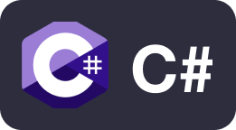

## Hi there 👋
Welcome to my Github profile! I am Thijs, a 21 year old software engineer from the Netherlands. I currently don't contribute much to open source software, but really want to give it a go in the near future.

## About me
- Bachelors degree in Computer Science from Utrecht University
- Lead backend engineer and system architect at GraphPolaris, a graph data analysis and visualisation startup
- Enjoy architecting scalable, reliable, fault-tolerant, and fast solutions for complex problems
- Learning more about the blockchain, smart contracts, and all things DeFi

## Languages I use

  
  
  
  
  

## Tools I use

  
  
  
  
  
  

## Frameworks I use

  

